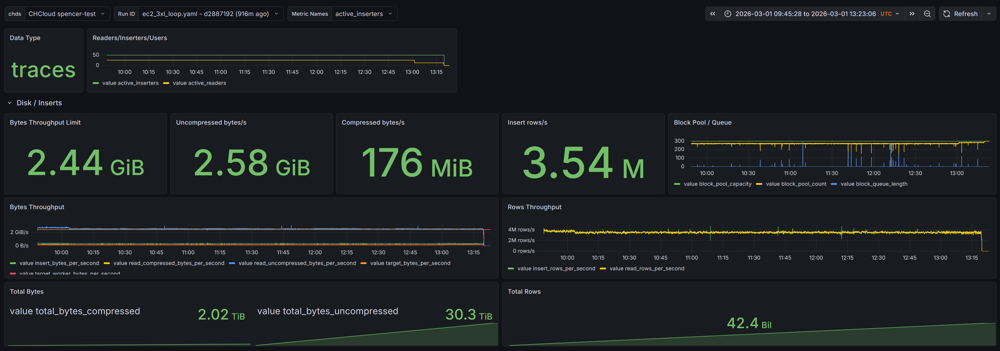

<h1 align="center">ClickCannon</h1>

# About

A program for replaying OTel data into ClickHouse and simulating concurrent user queries against it. Four independent modes can be run in any combination:

- **disk** — reads `.native`/`.native.zst` files from disk and feeds them to the insert workers
- **generate** — generates synthetic OTel data (logs, traces, or profiles) from a code-defined profile and feeds it to the insert workers
- **insert** — inserts data into ClickHouse via ch-go
- **user** — simulates concurrent users running parameterized queries against ClickHouse

`disk` and `generate` are mutually exclusive data sources — enable one or the other. Each mode is independently toggled via `enabled` in the config. You can run `generate` + `insert` to load synthetic data, `disk` + `insert` to replay existing data, or `user` alone against an already-populated table.

([development blog post](https://clickhouse.com/blog/building-clickcannon-a-tool-for-benchmark-clickhouse))

# Usage

Copy `example.yaml`, edit it for your environment, and enable the modes you want.

Run with Go:
```sh
go run clickcannon --config my-config.yaml
```

Or build a binary first:
```sh
go build -o clickcannon . && ./clickcannon --config my-config.yaml
```

Or with Docker (mount your config and data):
```sh
docker build -t clickcannon .
docker run -v $(pwd)/my-config.yaml:/root/my-config.yaml \
           -v $(pwd)/trace_data:/root/trace_data \
           clickcannon ./clickcannon --config /root/my-config.yaml
```

The config path can also be set via environment variable:
```sh
CLICKCANNON_CONFIG=my-config.yaml go run clickcannon
```

By default a random UUID is generated as the run ID each time the program starts. To set a specific run ID, set `CLICKCANNON_RUN_ID`:
```sh
CLICKCANNON_RUN_ID=my-run-id go run clickcannon --config my-config.yaml
```

## As a library

The `api` package embeds ClickCannon in another program. Unlike the binary it never calls `flag.Parse`, `os.Exit`, or `signal.Notify`, and returns errors instead of printing them. Build a `Config`, then run it:

```go
cfg := api.Config{}
cfg.App.DataType = api.DataTypeLogs
cfg.Generate = api.GenerateConfig{
    Enabled:       true,
    Threads:       1,
    RowsPerSecond: 10_000,
    RowsPerBlock:  10_000,
    ReuseBlocks:   true,
}
cfg.OTel = api.OTelConfig{
    Enabled:   true,
    URL:       "localhost:4317",
    Insecure:  true,
    Threads:   1,
    BatchSize: 10_000,
}

ctx, cancel := context.WithTimeout(context.Background(), time.Minute)
defer cancel()

if err := api.Run(ctx, cfg, slog.Default(), "run-id-123"); err != nil {
    return err
}
```

`Run` blocks until the context is cancelled or every worker finishes, for progress while it runs drive the `Runner` yourself:

```go
r, err := api.NewRunner(cfg, nil, "")
if err != nil {
    return err
}
if err := r.Start(); err != nil {
    return err
}

go func() {
    for range time.Tick(15 * time.Second) {
        s := r.Stats()
        fmt.Println(s.GeneratedRows, s.OTelRows, s.OTelExportsFailed)
    }
}()

return r.Wait(ctx) // stops the runner and drains the pipeline
```

`Stats` is only populated when `Config.Metrics` is enabled, which requires a ClickHouse DSN.

# Data Sources

ClickCannon supports two data sources: disk replay and synthetic generation. Use one or the other.

## Generate (synthetic data)

The generate mode creates synthetic OTel data directly — no pre-exported files needed. Data shape is defined by a code-built **profile** registered at init() time in `internal/generate/profile_*.go`. `otel_demo` is a built-in profile for generic OTel demo data. Pick one in YAML:

```yaml
generate:
  enabled: true
  threads: 8
  rows_per_block: 8192
  rows_per_second: 0  # 0 = unlimited
  reuse_blocks: true
  block_retirement_uses: 50
  # Name of a code-defined profile. Defaults to otel_demo.
  profile: otel_demo
  # Trace-specific settings (only used when data_type: traces)
  traces:
    spans_per_trace_min: 3
    spans_per_trace_max: 12
    max_depth: 5
    duration_min_us: 1000
    duration_max_us: 5000000
  # Profile-specific settings (only used when data_type: profiles)
  profiles:
    samples_per_profile_min: 50
    samples_per_profile_max: 500
    stack_depth_min: 5
    stack_depth_max: 64
    duration_min_ms: 1000
    duration_max_ms: 60000
    period_ns: 10000000
```

Adding a new generator profile means writing one Go file that calls `generate.RegisterProfile("name", builder)` from `init()`.

Generators available: `Pool/V`, `Const`, `RandStr(n).Prefix(p)`, `Hex(n).Prefix(p)`, `UUID()`, `IP().AsU32()/AsHex()`, `Int(min, max).Prefix(p)`, `Float(max).Precision(n).Prefix(p)`, `Bool(trueProb)`. Map columns use probabilistic key presence — each key has a per-row probability of appearing. `KP` produces unique keys (prefix + random hex) for thrashing LowCardinality dictionaries.

When generating traces, each worker independently produces complete traces with correlated `TraceId`/`SpanId`/`ParentSpanId` hierarchies. When generating profiles, each worker produces whole profiles — many unique-stack sample rows sharing a `ProfileId`, timestamp, duration, period, and resource attributes — where each row carries a random-depth call stack (function/file/mapping names, addresses, line numbers) and per-sample attributes. All randomness is seeded from `app.seed` for reproducible runs.

`profiles` is supported by the disk, generate, and insert pipelines only — the otel export sink does not support it.

## Disk (replay from files)

Replays pre-exported data from disk.

Export logs:
```sql
SELECT * FROM otel.otel_logs LIMIT 10000000 INTO OUTFILE 'log_data/logs.native.zst' COMPRESSION 'zstd' FORMAT Native
```

Export traces:
```sql
SELECT * FROM otel.otel_traces LIMIT 10000000 INTO OUTFILE 'trace_data/traces.native.zst' COMPRESSION 'zstd' FORMAT Native
```

Export profiles:
```sql
SELECT * FROM otel.otel_profiles LIMIT 10000000 INTO OUTFILE 'profile_data/profiles.native.zst' COMPRESSION 'zstd' FORMAT Native
```

You can split data across multiple files — each file becomes a unit of work for the disk reader threads.

# Memory Management

ClickCannon includes two workarounds for memory growth that occurs during long runs. Both are caused by ch-go accumulating allocations over time and are addressed by periodic retirement of the relevant objects.

## Block retirement (`disk.block_retirement_uses`)

When `disk.reuse_blocks` is enabled, native blocks read from disk are recycled rather than garbage collected after each insert. This improves throughput stability by avoiding GC pressure, but ch-go has a quirk where column slice backing arrays grow each time a block is reset and refilled — memory is never returned. Over a long run this causes steady memory growth.

`block_retirement_uses` sets a limit on how many times a block can be reused before it is discarded and replaced with a fresh allocation. Setting this to a reasonable value bounds the growth without giving up the throughput benefits.

**Deriving a value:** Check your Grafana dashboard for memory growth rate and insert throughput. A block is retired after N uses regardless of size, so a lower value means more frequent fresh allocations (more GC) but tighter memory bounds. 100 is a reasonable starting point. If memory is still growing, lower it; if GC pauses are visible in throughput, raise it.

Set to `0` to disable retirement (blocks live for the program's lifetime, original behavior).

## Insert worker retirement (`insert.worker_retirement_batches`)

The ch-go encoder inside each insert worker accumulates buffer allocations over time as it encodes blocks. These buffers grow to fit the largest block seen and are never shrunk. Over many batches this causes each worker's memory footprint to drift upward.

`worker_retirement_batches` sets how many batches a worker sends before it exits and is replaced by a fresh one. Workers are staggered so they don't all restart simultaneously: each worker i gets an initial batch offset of `(i * retirement_batches) / threads`. It then counts from that offset and retires after sending exactly `retirement_batches` batches, so every worker sends the same number regardless of its position. The offsets spread retirements evenly across the retirement window, and because the offset is recalculated from the stable worker ID on each restart, the stagger is maintained for the life of the program.

**Deriving a value:** Estimate your target throughput in batches per second (throughput / `insert.batch_size`), then decide how often you want workers to recycle. For a run targeting 1M rows/s with `batch_size=100000`, that's ~10 batches/s; retiring every 100 batches means a recycle roughly every 10 seconds per worker. Lower values reduce peak memory per worker but add reconnection overhead. Higher values allow more drift.

Set to `0` to disable retirement (workers run indefinitely, original behavior).

# Grafana

A Grafana dashboard is included in `grafana.json`. Import it via Dashboards > Import in the Grafana UI. It reads metrics from the ClickHouse server configured under `metrics` in your config.

### Disk & Insert panels




### User Query panels


